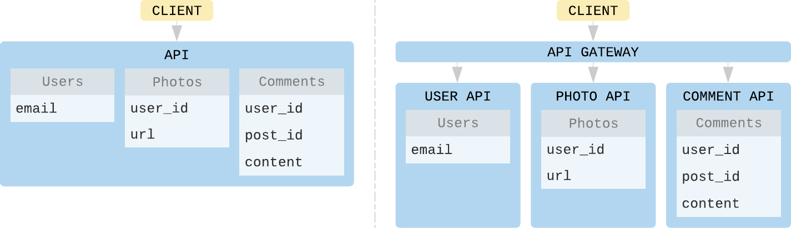

[Kit::Api]: https://github.com/rubykit/kit/tree/master/libraries/kit-api
[JSON:API]: https://jsonapi.org
[GraphQL]: https://graphql.org/
[Kit]: https://github.com/rubykit/kit

# About APIs

APIs are a way of doing message-passing between systems.

They allow a client to access & act on ressources of a remote system, while hidding most of the complexity of that system (encapsulation).

[JSON:API] & [GraphQL] are two set of specifications that help you build API's in a standardized way, faster, avoiding bikeshedding.

## What truly matters

[Kit] helps you design your apps in a domain driven way. The "growth-ready" way is to build your domain in a mono-repo. At first, they will likely be exposed through the same app-container in production, as it is simpler & cheaper.

External clients will be able to connect to 1 API.

As your business & system grow, there will be valid reasons to expose these domains as different apps in production. So now you effectively have N APIs,
but you don't want clients to have to know about the specifics of the production setup.

This is why having a way to aggregate & expose the various graphs (resources + operations of your domain) through a gateway is important.

## Layers

There are different layers that can be identified for any API.

| Properties | Definition |
| -------- | -------- |
| `A` Query interface | How you express your request (acting on data) |
| `B` Query format | How the various operations (read, create, update, delete) are expressed. |
| `C` API's resources standardization | How you standardize your API's business resources. This allows API auto-discovery and connecting graphs. (Ex for Stripe: PaymentSource, Charge, Refund, etc). |
| `D` Response format | The API's response format (serialization). |

Once we identify them in the specs, we gain the ability to build APIs that can be exposed for free through both standards.

You can even mix & match if you find a valid usecase, like: `GraphQL query interface + GraphQL resources standardization + JSON:API response format`)

This is what [Kit::Api] is about.
